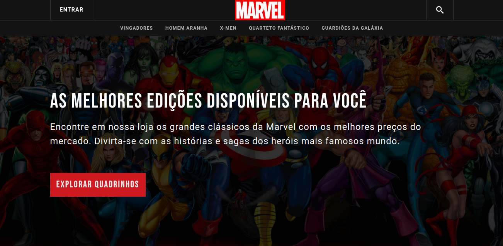

<h1 align="center">Marvel React Store 🛒️</h1>

<h2 align="center">
  An application that simulates a Marvel comic book shopping cart.
</h2>

 

  
  
  

 

  

  
  

 

  <a href="#goal">Goal</a> •
  <a href="#features">Features</a> •
  <a href="#technologies">Technologies</a> •
  <a href="#author">Author</a>

 

<h2 id="goal">🎯️ Goal</h2>

 

  The goal of Marvel React Store is simulate a Marvel comic book shopping cart.

 

<h2 id="features">💻️ Features</h2>

 

- [ ] User registration
- [ ] User authentication
- [x] Comics list
- [ ] Add to cart
- [ ] Remove from cart

 

<h2 id="technologies">🛠 Technologies</h2>

 

The following tools were used in the development of the project:

- [React](https://pt-br.reactjs.org/)
- [React Icons](https://react-icons.github.io/)
- [Marvel's api](developer.marvel.com)

 

<h2 id="author">✏️️ Author</h2>

 

<a>
  
   
  <strong>Lucas Santos</strong>
</a>

 

Get in touch!

<h4 align="center">
🚧  Marvel React Store 🛒️ In development...  🚧
</h4>
